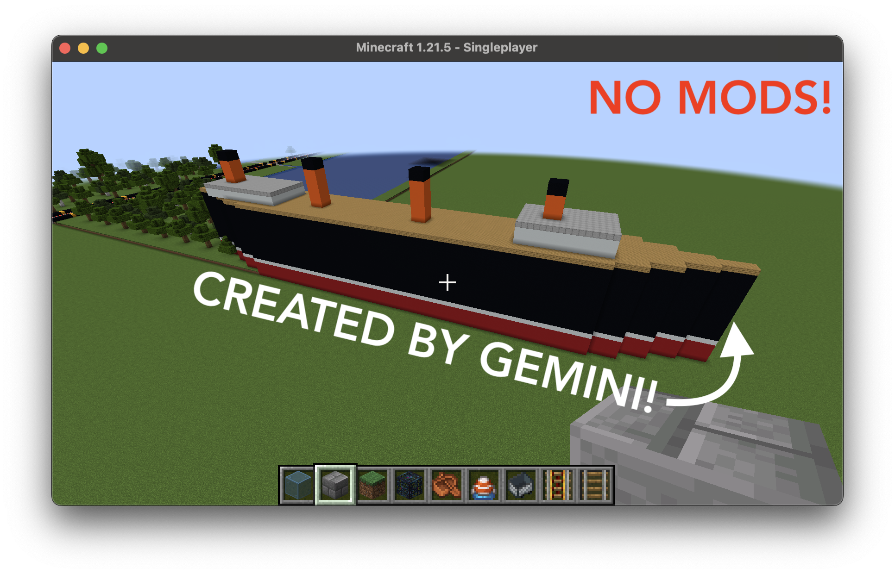

# Vibecraft

LLM-powered Minecraft construction tool.



- Choose from a range of LLMs (if it is supported by LangChain, it works here!)
- No mods required! Works with 100% vanilla Minecraft: Java Edition, simulating keyboard input to enter commands.

## Usage
### Step 0: Clone repo and install dependencies
Clone this repo, then in its root run `pip install -r requirements.txt` to install dependencies. You will also need to install a LangChain integration package for the LLM you are using (see [LangChain documentation](https://api.python.langchain.com/en/latest/chat_models/langchain.chat_models.base.init_chat_model.html) for list) and might need to configure your shell environment for its API.

### Step 1: Generate intermediate blueprint
The first step is to make the LLM generate an intermediate blueprint which defines step-by-step, reproducible instructions for building the object.
```sh
python design.py --prompt "Realistic model of RMS Titanic" --blueprint_path my_titanic.json --model gemini-2.5-flash --provider google_genai
```

### Step 2: Enter into Minecraft console
To convert the blueprint into Minecraft commands and enter them to build the structure, Make Minecraft the active window with a blank console open, and run `build.py` on the intermediate blueprint JSON. `origin` specifies lower bounds on the coordinates of the build in all 3 dimensions.
```sh
python build.py --blueprint_path my_titanic.json --origin 0 80 0
```

## Notes
Please beware that if your computer goes to sleep or the cursor changes to another window in the middle, gibberish Minecraft commands could be entered into other text fields (e.g. a password field), so please make sure to plan for this (keep your computer awake, mute notifications and popups). No liability accepted whatsoever for damage!

## Contributions
Not accepted, sorry

## Search tags
[AI Minecraft builder; AI-powered Minecraft; How to make AI play Minecraft; LLM Minecraft command generator; integrate AI into Minecraft; Minecraft AI mod]
